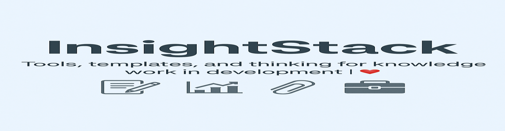

# 🧠 InsightStack

**InsightStack is a personal response to a recurring problem:**  
in development work, we talk about knowledge — but rarely structure it.  
Reports are scattered, templates are recreated from scratch, and institutional memory is fragile.  
This repository is my attempt to change that.

InsightStack is a documentation-first, logic-driven knowledge repository built from years of work across research, evaluation, program design, and policy strategy. It brings together tools, templates, and methods that help answer one core question:

🧩 **How do we build systems that learn, instead of start over every time?**

---

## 📁 What’s Inside

| Folder | Description |
|--------|-------------|
| `calculators/` | Planning tools — population projections, development estimators, environmental change calculators |
| `KM_tools/` | Templates and SOPs for documentation, tagging, and version control in knowledge work |
| `learning_layers/` | Explanatory modules and frameworks on building institutional knowledge and learning systems |
| `banner/` | Visual assets for repo identity |

---

## 🛠️ What It’s For

This repo is for anyone working in:
- Public health, climate, education, or WEE programs in South Asia
- MEL teams building documentation systems that go beyond Excel trackers
- Researchers and analysts writing reports that need to live longer than a funding cycle
- Program leads tired of reinventing logic models and tagging templates

---

## 🧭 How to Use

- Clone or download the repository
- Explore individual folders — everything is open, documented, and editable
- Plug in your own data into calculators or adapt them to your setting
- Use the SOPs in `KM_tools/` to create your own tagging systems, documentation trackers, and research logs
- Contribute back via pull requests or suggestions

---

## 🔖 Badges

  

---

## 📘 Citation

If you use **InsightStack** in your work, please cite it as:

> Varna Sri Raman. (2025). *InsightStack: Knowledge Documentation for Development Research* [Data & Tools]. Zenodo. [https://doi.org/10.5281/zenodo.15245182](https://doi.org/10.5281/zenodo.15245182)

---

## 🧠 Related Repositories

- 🔬 [EquityStack](https://github.com/Varnasr/EquityStack): Modular Python workflows for public health, WEE, MEL, and education data analysis  
- 📊 [FieldStack](https://github.com/Varnasr/FieldStack): Applied R templates and calculators for social sector research and dashboard-ready outputs  

---

## 💬 Contact

Want to contribute or adapt it for your own org?  
Drop a message via GitHub issues or email me: [varna.sr@gmail.com](mailto:varna.sr@gmail.com)

---

### 📄 License

This repository is licensed under the [MIT License](./LICENSE). Use freely, adapt creatively, credit generously.

---

© 2025 Varna Sri Raman. Built for open knowledge, shared learning, and programmatic memory.
