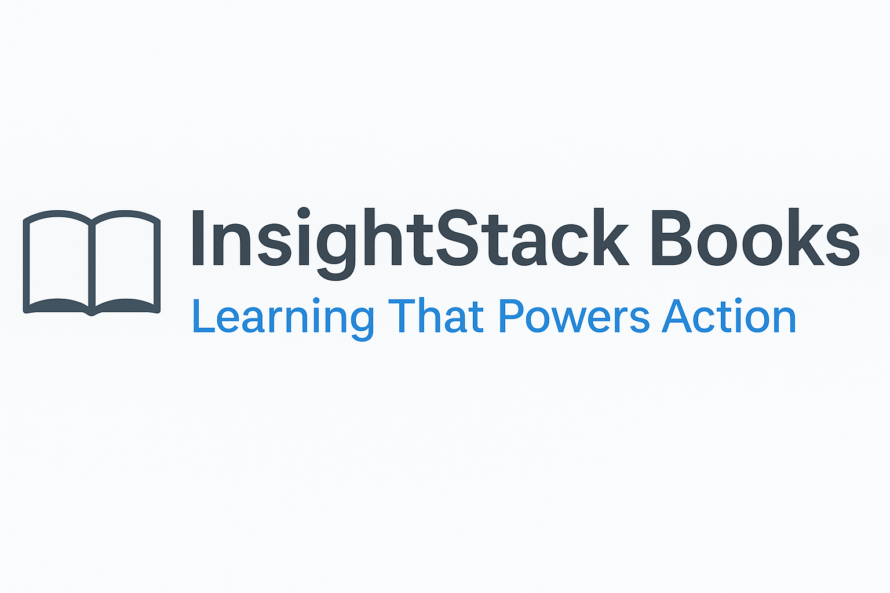

# 📚 InsightStack Books

This section of InsightStack gathers structured insights from carefully selected books relevant to field research, MEL, participatory methods, knowledge management, and modern data workflows.

Each subfolder adapts key ideas into practical formats — not just summaries, but usable notes, frameworks, templates, and examples.

These are:
- **Extracted for Action:** Focused on methods, workflows, and applications.
- **Curated Carefully:** Only books with real practical relevance are included.
- **Organized Clearly:** Each book has its own mini-structure for easy navigation.

We believe that deep learning from good books, when converted into usable tools and approaches, can meaningfully strengthen research and development work.

---

# 📖 Books Tracker

| Book Title                              | Author                 | Focus Area                         | Date Added |
|:----------------------------------------|:-----------------------|:-----------------------------------|:-----------|
| Network Collective Action               | (Author TBD)           | Decentralized Participation, MEL   | Apr 2025   |
| Learning Generative AI Tools for Excel  | Angelica Lo Duca       | AI + Excel Automation for Research | Apr 2025   |

_(New entries can be added below as the collection grows!)_

---

# 📋 Planning Future Books

A list of future books to adapt is maintained in [TODO.md](TODO.md).  
Please check there for upcoming expansions to the Books section!

---

---

*Banner created using OpenAI tools in accordance with InsightStack visual guidelines.*
